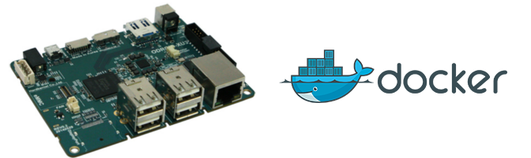
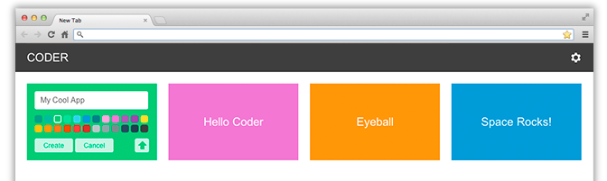

+++
date = "2016-03-04T02:09:17+02:00"
draft = false
title= "Google Coder en un contenedor Docker sobre la arquitectura ARMv7 de una ODROID-XU3 Lite"
tags = ["ARMv7","Docker","Google Coder","Odroid"]
categories = ["Aprendizaje", "Tecnología"]
aliases = ["/google_coder_docker_arm"]
comments = true	# set false to hide Disqus
share = true	# set false to hide share buttons
author = "Eloy López"
featured = false
description = "Lo reconozco, soy de los que tienen el síndrome de la última versión y actualizo todo aun cuando es arriesgado actualizar..."
# image ="/static/deftwork.png"
+++

Lo reconozco, soy de los que tienen el síndrome de la última versión y actualizo todo aun cuando es arriesgado actualizar, lo cual suele traer muchísimos dolores de cabeza y trabajo añadido, como, el de volver empezar de cero a configurar todo. No lo puedo evitar, por eso, en cuanto vi que estaba disponible última actualización de la versión Ubuntu para Odroid-xu3 no me pude resistir.

Por suerte hay veces que vale la pena probar, ya que muchos de los problemas de la versión anterior se resuelven y se mejoran otras cuestiones, como, por ejemplo, la de instalación de Docker que en versiones anterior era bastante tediosa, porque entre otras cosas había que recompilar el kernel.

En la versión actual solo hay que seguir <a href="https://github.com/umiddelb/armhf/wiki/Installing,-running,-using-docker-on-armhf-(ARMv7)-devices" target="_blank">estas instrucciones</a>, una vez está todo configurado, levantar los contenedores es casi igual de sencillo que en cualquier Docker sobre un PC normal, solo hay que tener en cuenta que solo se podrán utilizar aquellas imágenes preparadas para la arquitectura ARMv7.

Sí como a mí, te gusta cacharrear y probar todos los proyectos que circulan por internet, encapsular estas aplicaciones es una ventaja porque ayuda a mantener limpio tu sistema base, ya que no instalas nada sobre él sino sobre los contenedores.

Google coder es una herramienta de aprendizaje enfocada en la educación, para todo aquel que quiera empezar a programar, fue pensaba que pudiera ser ejecutado en un hardware económico como el de la Raspberry Pi pero es perfectamente compatible con Odroid porque comparten arquitectura.

Para probarlo, basta con ejecutar una sola línea de comando:

> sudo docker run -d -p 8080:8080 -p 8081:8081 hypriot/rpi-google-coder

Y abrir el navegador en el puerto especificado:

<a href="http://localhost:8080" target="_blank">localhost:8080</a>
